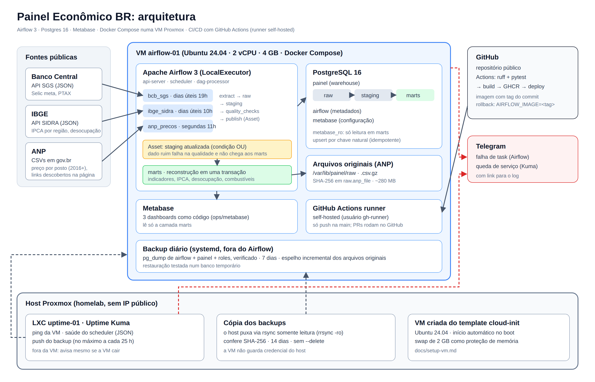
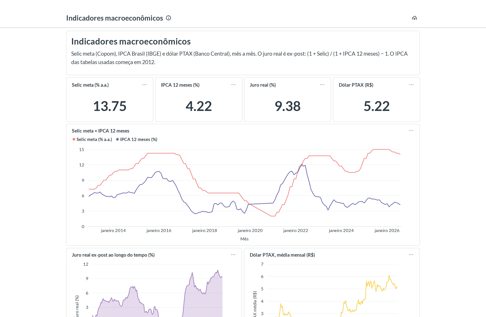
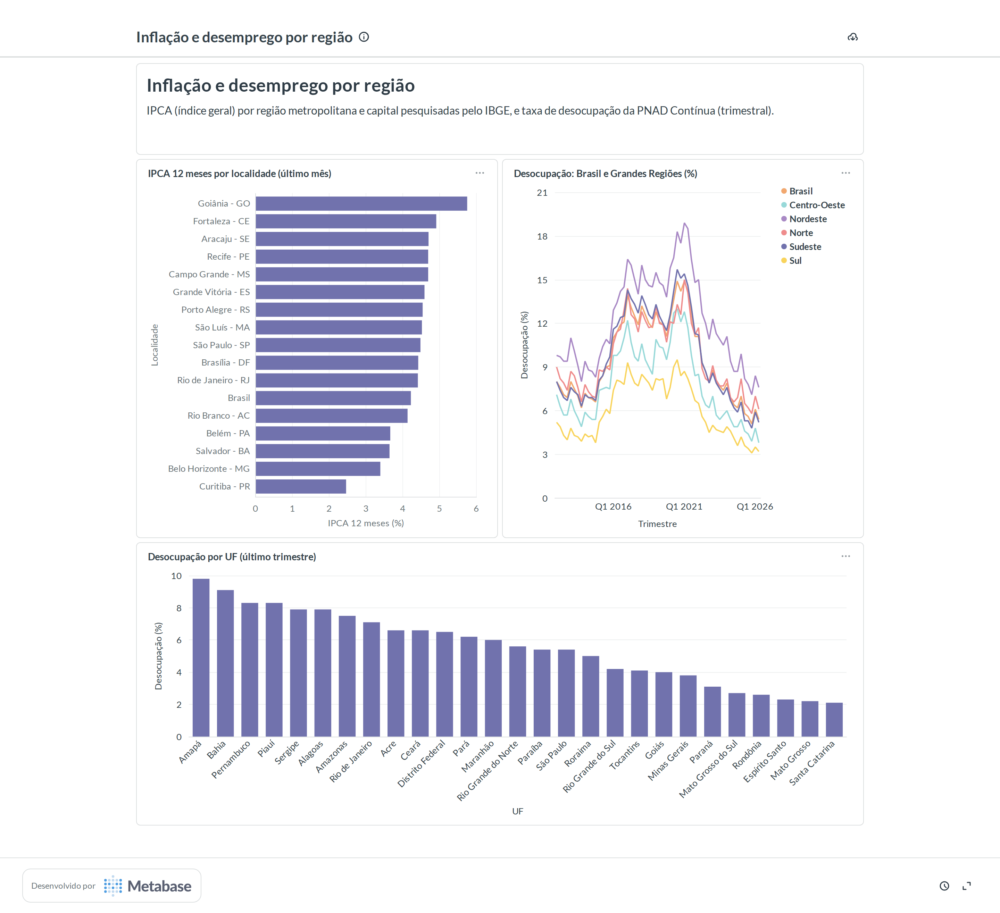
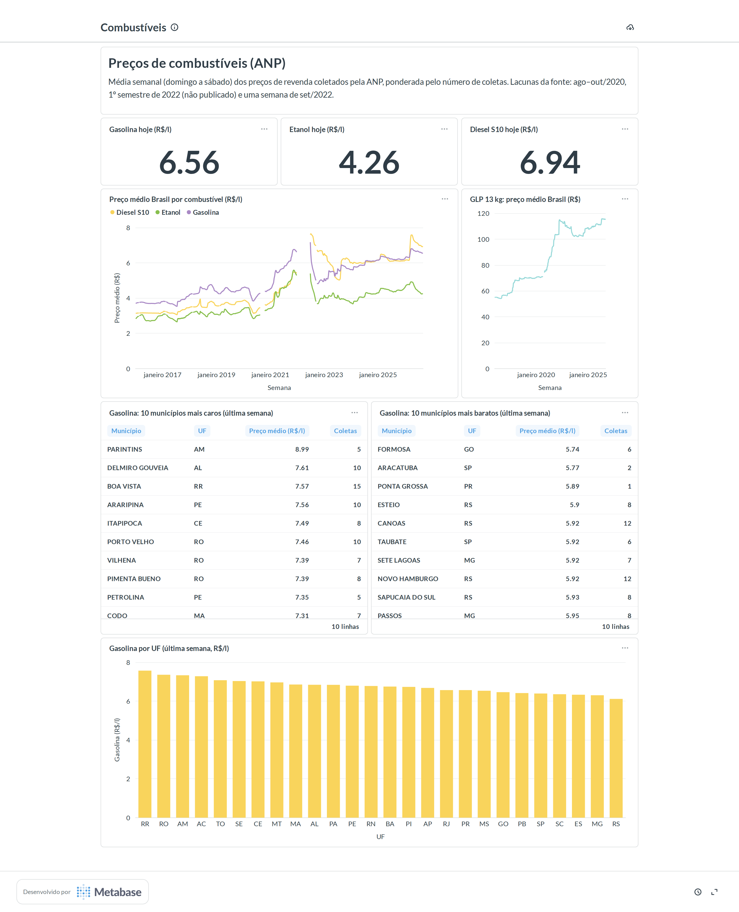

# Painel Econômico BR

[](https://github.com/marcoADevOps/painel-economico-br/actions/workflows/ci-cd.yml)

Pipeline de dados da economia brasileira orquestrado pelo **Apache Airflow 3**. Ele coleta todo dia os dados do **Banco Central**, do **IBGE** e da **ANP**, organiza em camadas num **Postgres** e publica dashboards no **Metabase**. Tudo roda 24/7 numa VM do homelab (Proxmox), com deploy automático por **GitHub Actions**, alertas no **Telegram**, monitoramento no **Uptime Kuma** e backup verificado.



📄 **Documentação completa em PDF:** [docs/painel-economico-br.pdf](docs/painel-economico-br.pdf) (gerada por `docs/build_pdf.py`).

## Destaques

- **4 DAGs em produção**: três fontes independentes e uma camada de marts disparada por *Assets* do Airflow 3.
- **Idempotente de ponta a ponta**: upsert por chave natural. Reexecutar qualquer DAG, ou recarregar o histórico inteiro, não duplica nenhuma linha (testado).
- **Portão de qualidade**: 12 checagens (duplicados, nulos, faixa plausível, atraso) rodam **antes** de publicar a staging. Dado ruim falha a task, gera alerta e não chega aos dashboards.
- **Histórico carregado**: Selic e PTAX desde 2000, IPCA e desocupação desde 2012, e preços de combustíveis desde 2016 em ~600 municípios (1,2 milhão de linhas semanais, a partir de ~11 milhões de coletas).
- **Resiliente a fontes instáveis**: nova tentativa por requisição, retomada de downloads cortados e checksum dos arquivos. Uma carga interrompida continua de onde parou.
- **CI/CD**: `ruff` + `pytest` (115 testes) → imagem no GHCR com a tag do commit → `docker compose up --wait` na VM. Um `git push` atualiza o ambiente sem intervenção manual.
- **Operação**: alertas de falha no Telegram com link para o log, Uptime Kuma fora da VM, backup diário com cópia no host e restauração testada. Desligar e religar a VM não perde dados.
- **Dashboards como código**: 3 dashboards e 18 perguntas definidos em Python e provisionados pela API do Metabase.

## Dashboards

### Indicadores macroeconômicos


### Inflação e desemprego por região


### Combustíveis


## Stack

| Camada | Tecnologia |
|---|---|
| Orquestração | Apache Airflow 3.3 (`LocalExecutor`, TaskFlow API, Assets, mapeamento dinâmico de tasks) |
| Armazenamento | PostgreSQL 16: metadados do Airflow, data warehouse (`raw`, `staging`, `marts`) e configuração do Metabase |
| Visualização | Metabase v0.63, lendo só `marts` com um usuário somente leitura |
| Infra | Docker Compose numa VM Ubuntu 24.04 (2 vCPU, 4 GB) no Proxmox |
| CI/CD | GitHub Actions com runner self-hosted na VM e imagens no GHCR |
| Observabilidade | alertas no Telegram, Uptime Kuma num LXC separado, healthchecks em todos os contêineres |
| Qualidade de código | `ruff`, `pytest` (115 testes), teste de importação de todos os DAGs |

## Estrutura

```
dags/        um DAG por fonte + marts; só orquestração
src/painel/  extração, transformação, carga, qualidade e alertas (testáveis sem o Airflow)
sql/         DDL das camadas e SQL de reconstrução dos marts
tests/       testes unitários e de integridade dos DAGs
docker/      Dockerfile (imagem de produção e de teste) e scripts de init do Postgres
ops/         backup (systemd), Uptime Kuma, dashboards do Metabase e scripts de configuração
docs/        guia da VM (docs/setup-vm.md) e imagens
compose.yaml stack: Airflow, Postgres, Metabase
```

## Lições aprendidas

Cada fonte pública tinha uma armadilha que só apareceu no teste real, e não na documentação:

| Problema | Onde | Solução |
|---|---|---|
| A API responde **HTTP 200 com uma página HTML de erro** | BCB | validar o conteúdo, não só o status; nova tentativa por janela |
| Uma carga de 26 anos falhava no meio e **recomeçava do zero** | BCB | pular janelas já guardadas em `raw`: a carga retoma de onde parou (de 40 min de falhas para 1 min) |
| O **ID da localidade se repete** entre níveis territoriais (Brasil e Norte são `1`) | IBGE | o nível territorial faz parte da chave natural |
| `Accept: application/json` recebe **HTTP 401** | ANP (gov.br/Plone) | pedir `text/html` e `*/*`, com um teste que garante isso |
| **Os mesmos dados publicados duas vezes**, em arquivos mensais e em semestrais | ANP | o semestral substitui os mensais do período (evita dupla contagem) |
| **Nomes de arquivo irregulares**: erros de digitação, sem extensão, `.zip` | ANP | descobrir os links na página e classificar pelo nome |
| O servidor **corta downloads** de 85 MB | ANP | retomar com HTTP Range e conferir o tamanho |
| O provider do Postgres usa **psycopg 3**, não psycopg2 | Airflow | SQL só com a DB-API padrão |
| `airflow dags test` num DAG ativo **disputa a task com o scheduler** | Airflow | testar DAGs ativos só com execuções normais após o deploy |
| Metabase em loop com `OutOfMemoryError: Metaspace` | VM de 4 GB | limitar o heap, e não o metaspace; swap como proteção |

## DAGs

### `bcb_sgs`: Banco Central (SGS)

| Série | Código SGS | Periodicidade |
|---|---|---|
| Meta Selic definida pelo Copom (% a.a.) | 432 | diária |
| Dólar americano (venda), PTAX de fechamento | 1 | diária (dias úteis) |

- **Agendamento:** dias úteis às 19h (horário de Brasília), com `catchup`.
- **Janela processada:** os 10 dias anteriores à data lógica da execução. Assim entram dados publicados com atraso ou revisados, e um período com a VM desligada é preenchido quando ela volta.
- **Fluxo de dados:**
  - `raw.bcb_sgs_response` guarda a resposta JSON original de cada janela consultada;
  - `staging.bcb_sgs_observation` guarda os dados tipados, com chave (`series_code`, `ref_date`).
- **Carga de histórico:** disparar manualmente com `start` e, se quiser, `end` (formato `YYYY-MM-DD`). O período é consultado em janelas de 1 ano, e as janelas já guardadas são puladas.
- **Particularidades do SGS:**
  - séries diárias aceitam no máximo 10 anos por consulta (HTTP 406 fora disso);
  - um período sem dados retorna HTTP 404 com `Value(s) not found`, o que é tratado como "sem dados".

### `ibge_sidra`: IBGE (SIDRA)

| Conjunto | Tabelas SIDRA | Variáveis | Localidades | Periodicidade |
|---|---|---|---|---|
| `ipca` | 1419 (2012–2019) e 7060 (desde 2020) | 63 (variação mensal), 2265 (acumulada em 12 meses), índice geral | Brasil, 10 regiões metropolitanas e 6 capitais | mensal |
| `desocupacao` | 4099 (PNAD Contínua) | 4099 (taxa de desocupação) | Brasil, Grandes Regiões e UFs | trimestral |

- **Agendamento:** dias úteis às 10h (o IBGE divulga às 9h), com `catchup`.
- **Janela processada:** os últimos ~13 meses em toda execução, com uma requisição por tabela.
- **Sinais especiais do SIDRA:** `-` é zero absoluto. `X`, `..` e `...` não têm valor; essas linhas são descartadas e contadas no log.

### `anp_precos`: ANP (preços de combustíveis)

Preço médio **semanal por município pesquisado e produto** (gasolina, gasolina aditivada, etanol, diesel, diesel S10, GNV e GLP), desde 2016.

- **Fonte:** CSVs de dados abertos com uma linha por posto, produto e data de coleta. Os links são descobertos na página oficial.
- **`raw`:** os arquivos originais ficam em disco, compactados (`.csv.gz`, ~280 MB), e `raw.anp_file` registra URL, SHA-256 e tamanho de cada um. Isso mantém o backup diário do banco pequeno; os arquivos originais são copiados de forma incremental.
- **`staging.anp_fuel_price_weekly`:** soma, mínimo, máximo e número de coletas por semana (domingo a sábado), município e produto, **por arquivo de origem**. Uma semana que cruza a virada do mês aparece em dois arquivos mensais, e os marts juntam as duas partes com média ponderada.
- **Agendamento:** toda segunda às 11h. Os arquivos dos últimos 60 dias são baixados de novo e só reprocessados se o SHA-256 mudar.
- **Capacidade:** no máximo 2 arquivos ao mesmo tempo, com pico medido de ~450 MB. A carga histórica levou ~11 minutos.
- **Lacunas da fonte:** ago–out/2020, 1º semestre de 2022 (não publicado pela ANP) e uma semana de set/2022.

### `marts`: tabelas para análise

Disparado por Assets sempre que `bcb_sgs`, `ibge_sidra` **ou** `anp_precos` publicam a staging. Com a condição OU, uma fonte com falha não segura as outras. Cada tabela é refeita numa única transação (`TRUNCATE` + `INSERT`), então quem consulta nunca vê uma tabela pela metade.

| Tabela | Grão | Conteúdo |
|---|---|---|
| `marts.monthly_indicators` | mês | Selic meta no fim do mês, PTAX média e de fechamento, IPCA Brasil (mensal e em 12 meses) e juro real ex-post: (1 + Selic) / (1 + IPCA 12m) − 1 |
| `marts.ipca_by_region` | mês × localidade | IPCA mensal e em 12 meses do Brasil, regiões metropolitanas e capitais |
| `marts.unemployment_by_region` | trimestre × localidade | Taxa de desocupação do Brasil, Grandes Regiões e UFs |
| `marts.fuel_prices_weekly` | semana × nível × produto | Preço médio, mínimo, máximo e número de coletas para Brasil, UF e município |

## Qualidade de dados

Os três DAGs de origem rodam `quality_checks` depois de carregar a staging e **antes** de publicar o Asset que dispara os marts. Se alguma checagem falhar, a task falha na hora, sem novas tentativas (repetir não conserta dado ruim), o alerta vai para o Telegram e os marts continuam com a última versão boa.

| Checagem | BCB | IBGE | ANP |
|---|---|---|---|
| Duplicados | uma linha por série e data | uma linha por conjunto, variável, categoria, nível, localidade e período | uma linha por semana, município, produto e arquivo |
| Nulos | colunas obrigatórias preenchidas | idem | idem, e pelo menos uma coleta |
| Faixa plausível | Selic entre 0 e 50% a.a.; PTAX entre R$ 0,50 e R$ 20 | IPCA mensal entre −5% e 10%; IPCA 12 meses entre −10% e 100%; desocupação entre 0 e 40% | média semanal entre R$ 0,50 e R$ 20 (líquidos e GNV) ou entre R$ 20 e R$ 300 (GLP 13 kg) |
| Atraso | Selic e PTAX com no máximo 7 dias | IPCA Brasil com no máximo 80 dias; desocupação com no máximo 240 dias | semana mais recente com no máximo 100 dias |

O atraso é medido em relação à data da execução (`as_of`), nunca em relação a "agora". Cada checagem é uma consulta SQL em `src/painel/quality.py` que retorna as linhas problemáticas.

## Operação

- **Alertas:** quando uma task falha de vez, o `on_failure_callback` manda no Telegram o DAG, a task, a execução, o erro e o link para o log. Uma falha persistente gera alerta em ~15 minutos (tentativas após 2, 4 e 8 min); parâmetros inválidos falham na hora.
- **Monitoramento:** o Uptime Kuma roda num LXC separado. Ele verifica o ping da VM e a saúde do scheduler, e recebe um push do backup diário.
- **Backup:** diário, às 03:30, pelo systemd e fora do Airflow. Faz `pg_dump` dos bancos `airflow` e `painel` mais as roles, e confere se cada dump pode ser lido. O host do Proxmox puxa as cópias por `rsync` somente leitura, confere o SHA-256 e guarda 14 dias. A restauração foi testada.
- **Rollback:** as imagens no GHCR têm a tag do commit. Basta trocar `AIRFLOW_IMAGE` no `.env` da VM e rodar `docker compose up -d`.

## Como rodar

Tudo roda na VM, dentro de contêineres. O passo a passo está em [docs/setup-vm.md](docs/setup-vm.md).

```bash
cp .env.example .env    # preencher os segredos (nunca vai para o Git)
docker compose up -d --build --wait
```

Lint e testes, na imagem de teste:

```bash
docker build -f docker/Dockerfile --target test -t painel-airflow:test .
docker run --rm painel-airflow:test python -m ruff check .
docker run --rm painel-airflow:test python -m pytest
```

Escopo, fases e critérios de aceite: [REQUIREMENTS.md](REQUIREMENTS.md).
